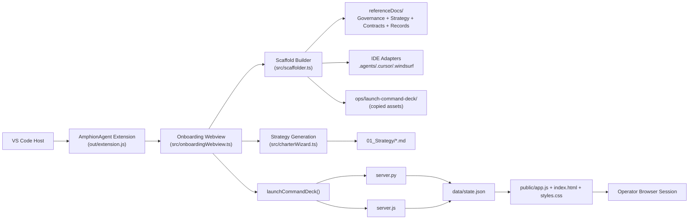
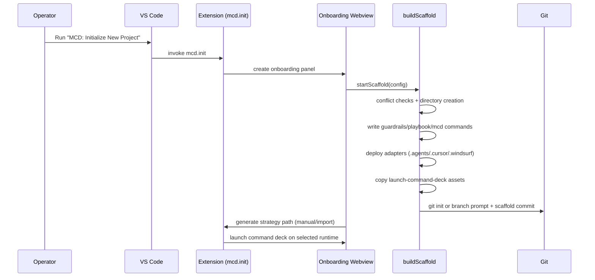
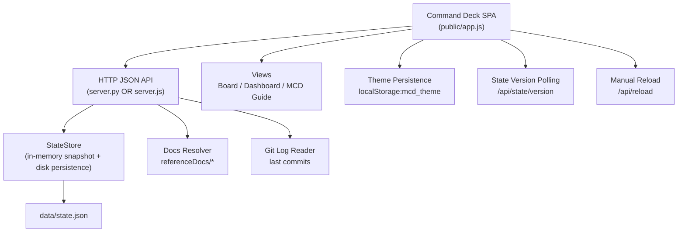
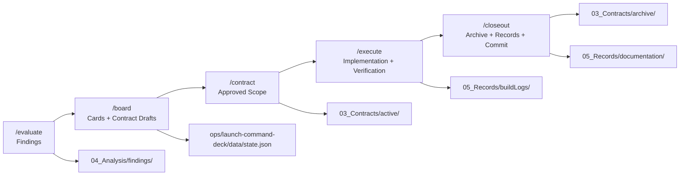

# AmphionAgent Extension System Architecture

**Codename:** `BlackClaw`  
**Record Date:** 2026-02-22  
**Scope:** Extension runtime, scaffold pipeline, Command Deck subsystem, and governance artifact lifecycle.

---

## 1. Purpose

This primitive documents the AmphionAgent extension as a system: how VS Code activation, onboarding flows, scaffold generation, command adapters, Command Deck runtime, and governance records interoperate to implement MCD.

---

## 2. Runtime Topology

---

## 3. Scaffold Generation Pipeline

---

## 4. Command Deck Service Architecture

---

## 5. Governance Artifact Lifecycle

---

## 6. Deterministic Boundaries and Invariants

- Extension command surface is intentionally narrow: one contributed command (`mcd.init`) with flow expansion handled in Webview and scaffolder.
- Scaffold is additive-by-design with conflict prompts for existing `referenceDocs/` and `ops/launch-command-deck/`.
- Command Deck backend is dual-runtime but API-compatible (`server.py` and `server.js`).
- Project governance is file-first and local-first: contracts/findings/records are persisted in-repo.
- State is deterministic and inspectable through `ops/launch-command-deck/data/state.json` with issue-number continuity.

---

## 7. Primary Implementation Anchors

- `mcd-starter-kit-dev/extension/src/extension.ts`
- `mcd-starter-kit-dev/extension/src/onboardingWebview.ts`
- `mcd-starter-kit-dev/extension/src/scaffolder.ts`
- `mcd-starter-kit-dev/extension/src/charterWizard.ts`
- `mcd-starter-kit-dev/extension/src/templates/commands.ts`
- `mcd-starter-kit-dev/extension/src/templates/adapters.ts`
- `ops/launch-command-deck/server.py`
- `ops/launch-command-deck/server.js`
- `ops/launch-command-deck/public/app.js`

