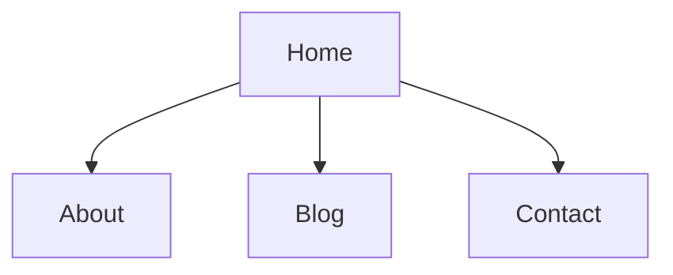

# EVALUATION: Seed Sample IA Chart in Charts Tab

**Phase:** 1 (Evaluate)  
**Status:** Complete  
**Date (UTC):** 2026-02-23T02:11:53Z  
**Codename:** `BlackClaw`

## 1. Request
Add a simple sample chart to the new Charts tab so users immediately understand the feature. Requested sample: website IA `Home > [About / Blog / Contact]`. User also wants this to be removable by asking the agent to delete it.

## 2. Current-State Research
- Charts tab UI and preview pipeline are now in place and functional.
- Chart data source currently resolves from `state.data.charts` in:
  - `ops/launch-command-deck/public/app.js` via `loadChartsFromState()`
- Current state payload in `ops/launch-command-deck/data/state.json` does not yet contain a `charts` array.

## 3. Gap Analysis
### Gap A: No seeded chart data
- The Charts tab currently shows empty state only because no chart entries exist in state.

### Gap B: No explicit sample content
- There is no out-of-box example demonstrating Mermaid render behavior inside the chart preview panel.

## 4. Scope Definition
### In Scope
- Add a top-level `charts` array to `ops/launch-command-deck/data/state.json`.
- Seed one sample chart record with:
  - title: simple IA example
  - short description
  - markdown containing a Mermaid diagram for `Home -> About/Blog/Contact`.
- Keep implementation lightweight and deterministic (no backend/schema changes).
- Document how operators can remove the sample.

### Out of Scope
- Chart CRUD UI.
- Chart persistence migrations or server APIs.
- Multiple template/sample packs.

## 5. Primitive Review
- **No new architecture primitive required.**
- Existing chart-view primitive already supports markdown + Mermaid rendering and selection.

## 6. Proposed Seed Payload (for contract)
Use a single sample entry like:
- `id`: `sample_ia_home_about_blog_contact`
- `title`: `Sample IA · Marketing Site`
- `description`: `Simple website structure example`
- `markdown`: Mermaid block

## 7. Operator Deletion Path
- Remove the chart object from `charts` array in `state.json` (or set array empty).
- Reload state from Command Deck (`Reload State`) to clear it from UI.
- This makes deletion deterministic and easy for future agent-assisted cleanup.

## 8. Recommended Contract AFPs
- `referenceDocs/03_Contracts/active/<timestamp>-CONTRACT_SAMPLE_IA_CHART_SEED.md` (new)
- `ops/launch-command-deck/data/state.json` (seed sample chart)
- `referenceDocs/05_Records/buildLogs/<timestamp>-EXECUTE_SAMPLE_IA_CHART_SEED.md` (new)
- `referenceDocs/05_Records/buildLogs/<timestamp>-WALKTHROUGH_SAMPLE_IA_CHART_SEED.md` (new)

## 9. Acceptance Targets for Follow-on Contract
- Charts tab displays one sample IA chart by default.
- Selecting sample chart renders Mermaid diagram in preview panel.
- Reload/refresh keeps deterministic behavior.
- Sample is removable by deleting entry from state and reloading.
